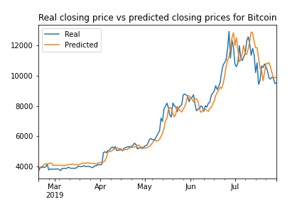
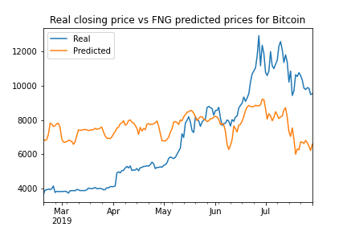

# Deep Learning: LSTM Stock Predictor

## 1. Background
Build and evaluate deep learning recurrent neural network models using both simple closing prices and FNG values [Crypto Fear and Greed Index (FNG)](https://alternative.me/crypto/fear-and-greed-index/), to determine if the FNG indicator provides a better signal for cryptocurrencies than the normal closing price data. Thus, which model is the best predictor for the closing price of bitcoin.

## 2. Data preparation for training and testing each RNN
There are 2 models (one applied in each jupyter notebook):
* For the Fear and Greed model, the FNG values are used to predict the closing price. 
* For the closing price model, the previous closing prices are used to predict the next closing price. 

Summary of steps performed:
* Each model uses 70% data or training and 30% of the data for testing.
* The MinMaxScaler is applied to the X and y values to scale the data for the model.
* Reshape the X_train and X_test values to fit the model's requirement of samples, time steps, and features.

## 3. Build and train custom LSTM RNNs
Design of a custom LSTM RNN and fit it using training data. 
* Define model architecture as sequential
* compile model
* fit model to training data

## 4. Evaluation and Findings
Various iterations of the model was executed to determine which model would be the best predictor. The window size and batch size was adjusted and outcomes compared. 

For all iterations, the model where the previous closing prices was used to predict the future closing prices, outperformed the FNG model each time. 

The model with the **lowest loss** was the Closing price model.

The model that **tracks the actual values best over time** is the Closing Price model.

The Closing Prices model with a **window size** of 3 works best.

Closing Price Model results:  

FNG closing price prediction model: 

## Jupyter notebooks
[Closing Prices Starter Notebook](Starter_Code/lstm_stock_predictor_closing.ipynb)

[FNG Starter Notebook](Starter_Code/lstm_stock_predictor_fng.ipynb)

## Data files
1. [Fear and greed sentiment data](Data/btc_sentiment.csv)
2. [Historical closing prices for Bitcoin](Data/btc_historic.csv)

